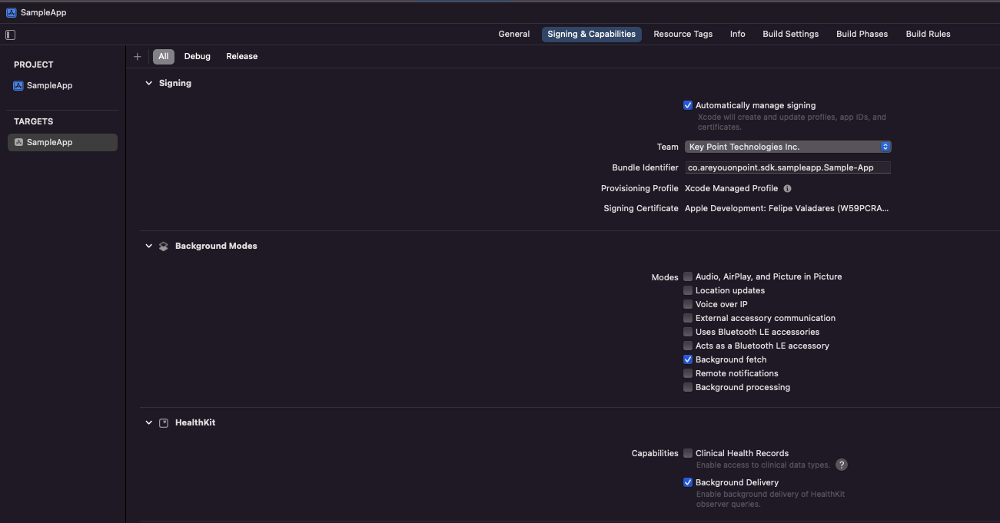

# Getting Started

Learn how to configure you project and start using the SDK

## Setting Up your Project
**Before start using Point SDK, you must perform the following changes to your Xcode project settings:**

1. Enable **HealthKit capabilities** in your app. 

2. Add permissions configuration

### Enable HealthKit capabilities
In Xcode, select the project and add the HealthKit capability.
It is highly recommended that you also enable **Background Delivery** and **Background fetch** capabilities.

For a detailed discussion about enabling Health Kit capabilities, see [Configure HealthKit](https://help.apple.com/xcode/mac/current/#/dev1a5823416) at the official Xcode Help.

### Permissions configuration
You must provide a message to the user explaining why the app is requesting permission to read samples from the HealthKit store.
To do so, set the [NSHealthShareUsageDescription](https://developer.apple.com/documentation/bundleresources/information_property_list/nshealthshareusagedescription) key to customize this message. 
For projects created using Xcode 13 or later, set these keys in the Target Properties list on the app’s Info tab. 
For projects created with Xcode 12 or earlier, set these keys in the apps Info.plist file. 
For more information, see [Information Property List](https://developer.apple.com/documentation/bundleresources/information_property_list).


## Setting Up Point SDK
In order to set up and start using Point, you must perform the following steps:
1. Initialize the SDK.

2. Request **User Permission** for reading the selected Apple Health data types.

3. Set user access token.

### Initializing Point SDK
Before any feature can be used, you must initialize the SDK providing your credentials and every Health Data Type you wish to use. For more information about the supported data types, please refer to ``HealthQueryType``.

It is recommended to do it at the start of your application.
```swift
@main
class AppDelegate: UIResponder, UIApplicationDelegate {
    func application(_ application: UIApplication, didFinishLaunchingWithOptions launchOptions: [UIApplication.LaunchOptionsKey: Any]?) -> Bool {
        Point.verbose = true // if want to see console logs about the SDK operations
        Point.setup(
            clientId: "YOUR_CLIENT_ID", 
            clientSecret: "YOUR_CLIENT_SECRET", 
            queryTypes: Set(HealthQueryType.allCases)
            environment: .development
        )
    }
}
```
> Important: Sending an empty set of types will disable all data collecting and <doc:PointHealthKit> features.

> Important: Important: Using **Point.verbose = true** will make the SDK print logs in the debug console about internal operations, filters, dates, errors, warnings and much more. This is helpful during development/integration phase, but we recommend turning it off before releasing your app into production.

### Requesting User Permissions
Request user permissions for all ``HealthQueryType`` defined at SDK setup. It is recommended to do it before setting the user token or attempting to evoke other SDK methods.
```swift
@MainActor
func requestPermissions() async {
    guard let pointHealthKitManager = Point.healthKit else { return }
    do {
        try await pointHealthKitManager.requestAuthorizationsIfPossible()
    } catch {
        print("Error requesting authorization: \(error.localizedDescription)")
    }
}
```


### Setting User's Access Token
 Set the user access token. It is recommended to do it as soon as possible, right after having requested user permissions.
```swift
func setupAccessToken(accessToken: String) async throws {
    try await Point.setUserToken(accessToken: accessToken)
}
```
> Note: The setUserToken function automatically triggers a Latest Data sync and also Historical Data sync if it's the first usage during that session. Refer to <doc:PointHealthKit> for more information about uploading data.

> Note: For more details about user authentication, refer to <doc:AuthenticatingUsers>


## Collecting and uploading samples
Use the <doc:PointHealthKit> to collect and upload health samples and basic user data to Point Database.

## Retrieving user data and generated metrics
Use the <doc:PointAPI> to retrieve user data and generated metrics such as recommendations, trends, workouts, health metrics and more.
